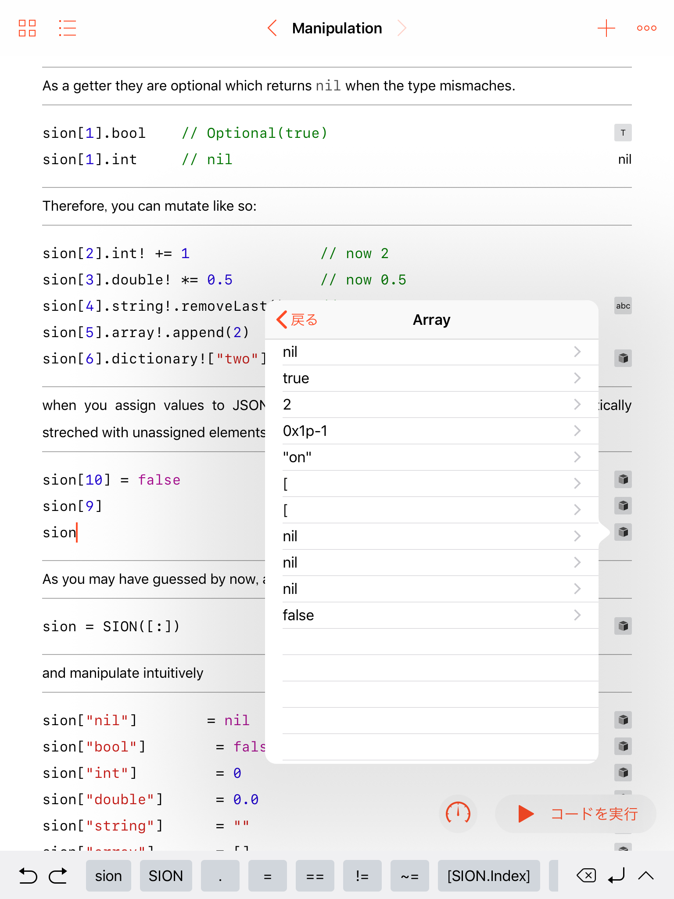

[](https://swift.org)
[](LICENSE)
[](https://github.com/dankogai/swift-sion/actions/workflows/swift.yml)

# swift-sion

[SION] handler in Swift.

[SION]: http://dankogai.github.com/SION/

## Synopsis

```swift
import SION
var sion:SION = [
    "nil":      nil,
    "bool":     true,
    "int":      -42,
    "double":   42.195,
    "string":   "漢字、カタカナ、ひらがなの入ったstring😇",
    "array":    [nil, true, 1, 1.0, "one", [1], ["one":1.0]],
    "dictionary":   [
        "nil":nil, "bool":false, "int":0, "double":0.0, "string":"","array":[], "object":[:]
    ],
    "url":"https://github.com/dankogai/"
]
sion["data"] = .Data("R0lGODlhAQABAIAAAAAAAP///yH5BAEAAAAALAAAAAABAAEAAAIBRAA7")
sion["date"] = .Date(0x0p+0)
sion["ext"]  = .Ext("1NTU") // 0xd4,0xd4,0xd4
```

This module is both an introduction and a reference implementation of `SION`, a data serialization formatlike [JSON] but more capable and expressive . As JSON is originated from a {ECMA,Java}Script literal, SION is originated from a Swift literal.  So like JSON was named after JavaScript Object Notation, SION was named after Swift Interchangeable Object Notation.  But as its name suggests, SION is language independent like JSON.

SION can serialize anything JSON can plus:

* support `Data`
* support `Date`
* non-`String` keys in `Dictionary`
* `Int` and `Double` distinctively, not `Number`.  Therefore you can exchange 64-bit integers losslessly.
* // comment support!
* Roughly equvalent to [MsgPack] in terms of capability.
  * [MsgPack] is a binary serialization while `SION` is a text serialization.

[JSON]: https://json.org
[MsgPack]: https://msgpack.org

| Type | SION | MsgPack | JSON | Property List | Comment |
|--------|---------------|-------|---|---|---|
| `Nil`           | ✔︎ | ✔︎ | ✔︎ | ❌ | plist: .binary only |
| `Bool`          | ✔︎ | ✔︎ | ✔︎ | ✔︎ |
| `Int`           | ✔︎ | ✔︎ | ❌ | ✔︎ | 64bit |
| `Double`        | ✔︎ | ✔︎ | ✔︎ | ✔︎ | JSON's Number |
| `String`        | ✔︎ | ✔︎ | ✔︎ | ✔︎ | utf-8 encoded |
| `Data`          | ✔︎ | ✔︎ | ❌ | ✔︎ | binary blob |
| `Date`          | ✔︎ | ✔︎ | ❌ | ✔︎ | .timeIntervalSince1970 in `Double` |
| `[Self]`        | ✔︎ | ✔︎ | ✔︎ | ✔︎ | aka Array |
| `[String:Self]` | ✔︎ | ✔︎ | ✔︎ | ✔︎ | aka Object, Map…|
| `[Self:Self]`   | ✔︎ | ✔︎ | ❌ | ❌ |non-`String` keys|
| `Ext`           | ✔︎ | ✔︎ | ❌ | ❌ |msgpack extension|


* As you see `SION` is upper-compatible with JSON and Property List.  As a matter of fact, `SION` can {,de}serialize JSON and Property List.

As for the format details, see the main page of [SION].

## DESCRIPTION

Is now at [DESCRIPTION.md].

[DESCRIPTION.md]: ./DESCRIPTION.md

## Usage

### build

```sh
$ git clone https://github.com/dankogai/swift-sion.git
$ cd swift-sion # the following assumes your $PWD is here
$ swift build
```

### REPL

Simply

```sh
$ swift run --repl
```

or

```sh
$ scripts/run-repl.sh
```

and in your repl,

```sh
  1> import SION
  2> let sion:SION = ["swift":["safe","fast","expressive"]]
sion: SION.SION = Object {
  Object = 1 key/value pair {
    [0] = {
      key = "swift"
      value = Array {
        Array = 3 values {
          [0] = String {
            String = "safe"
          }
          [1] = String {
            String = "fast"
          }
          [2] = String {
            String = "expressive"
          }
        }
      }
    }
  }
}
```

### Xcode

Xcode project is deliberately excluded from the repository because it should be generated via `swift package generate-xcodeproj` . For convenience, you can

```sh
$ scripts/prep-xcode
```

And the Workspace opens up for you with Playground on top.  The playground is written as a manual.  To run, make sure to check **Build Active Scheme** in **Playground Setting**.

### iOS and Swift Playground

Unfortunately Swift Package Manager does not support iOS.  To make matters worse Swift Playgrounds does not support modules.  But don't worry.  This module is so compact all you need is copy [SION.swift].

[SION.swift]: Sources/SION/SION.swift

In case of Swift Playgrounds just copy it under `Sources` folder.  If you are too lazy just run:


```sh
$ scripts/ios-prep.sh
```

and `iOS/JSON.playground` is all set.  You do not have to `import JSON` therein.

The playgoround is fully compatible with iOS.  Sync it via iCloud drive and enjoy!



### From Your SwiftPM-Managed Projects

Add the following to the `dependencies` section:

```swift
.package(
  url: "https://github.com/dankogai/swift-sion.git", from: "0.0.0"
)
```

and the following to the `.target` argument:

```swift
.target(
  name: "YourSwiftyPackage",
  dependencies: ["SION"])
```

Now all you have to do is:

```swift
import SION
```

in your code.  Enjoy!

## Prerequisite

Swift 5 or better, OS X or Linux to build.

